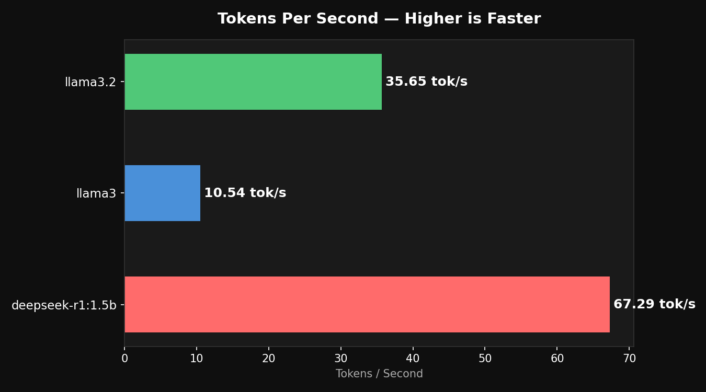
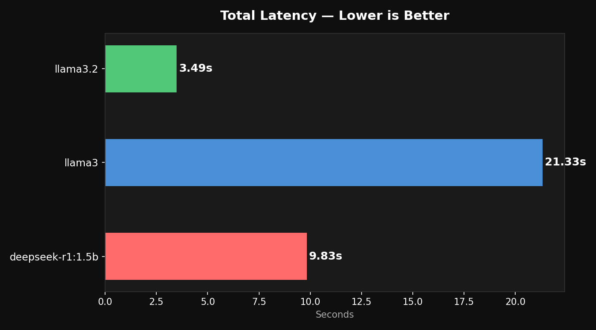
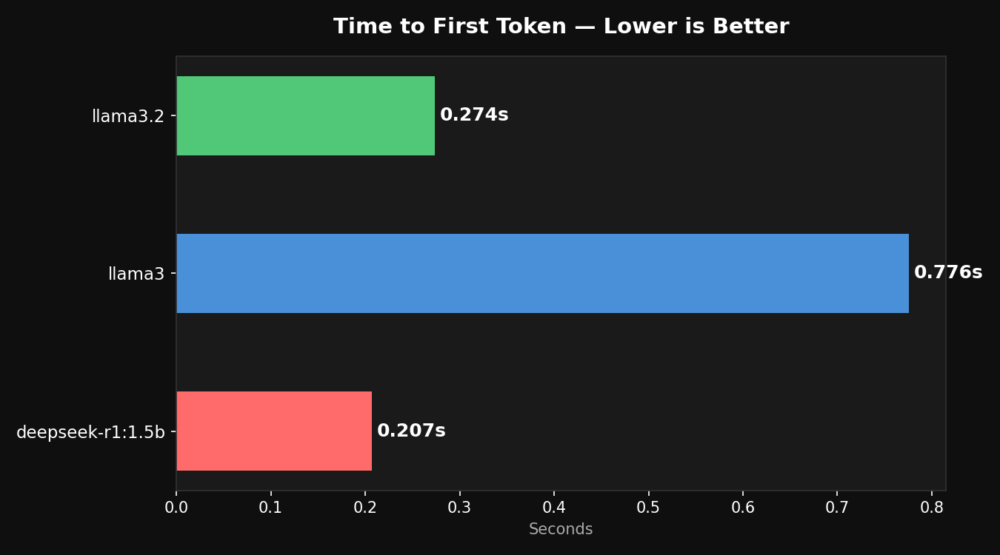
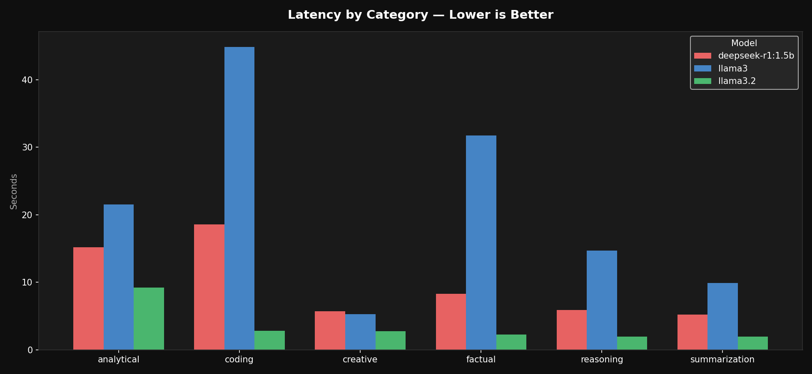

# Edgerunner — Local AI Benchmarking Tool

I built a tool that tests 3 AI models on my laptop with no internet, no API keys, and zero cost. It runs 90 questions across all 3 models, measures how fast and reliable each one is, and tells you which one to use depending on what you actually need.

## The Problem

Everyone just uses ChatGPT or Claude without asking if they need to. But there are real situations where you cannot:

- A hospital cannot send patient records to OpenAI
- A bank cannot send financial data to an external server
- A remote app with no internet cannot call any API
- A startup cannot afford $500/month in API costs at scale

I wanted to actually understand these constraints hands-on instead of just reading about them.

## What I Did

I downloaded 3 AI models once. After that everything ran 100% offline on my MacBook.

I tested all 3 models on the same 30 questions covering 6 topics — facts, reasoning, coding, summarization, creative writing, and analysis. That is 90 total tests.

For each test I measured how long until the first word showed up, how long the full answer took, and how many words it generated per second.

Then in Phase 2 I made each model respond in strict JSON format, validated it with Pydantic, and built an automatic retry if the output was broken.

## Results









| Model | First Word | Full Answer | Speed |
|---|---|---|---|
| deepseek-r1:1.5b | 0.21s | 9.83s | 67 tokens/sec |
| llama3.2 | 0.27s | 3.49s | 35 tokens/sec |
| llama3 | 0.78s | 21.33s | 10 tokens/sec |

**llama3.2** — fastest full response, best for real-time use

**deepseek** — fastest raw generation, best for bulk tasks

**llama3** — slowest but most detailed answers, best when quality matters most

## Latency by Category

The most interesting finding — llama3 takes 44 seconds on coding tasks. llama3.2 does the same in 2.81 seconds.

| Category | deepseek | llama3 | llama3.2 |
|---|---|---|---|
| coding | 18.59s | 44.86s | 2.81s |
| factual | 8.32s | 31.73s | 2.28s |
| reasoning | 5.92s | 14.67s | 1.95s |
| analytical | 15.20s | 21.55s | 9.20s |
| summarization | 5.24s | 9.88s | 1.99s |
| creative | 5.71s | 5.31s | 2.75s |

## JSON Reliability Test

I forced each model to respond in strict JSON and tested how reliable they were at two temperature settings:

| Model | Temp 0.0 | Temp 0.7 |
|---|---|---|
| llama3 | passed first try | passed first try |
| llama3.2 | passed first try | needed 1 retry |
| deepseek | failed completely | needed 1 retry |

If your app needs structured data outputs — use llama3 or llama3.2. Deepseek is fast but unreliable for JSON.

## How To Run It

### 1. Download Ollama and pull the models
Go to https://ollama.com and install it. Then:
```bash
ollama pull llama3
ollama pull llama3.2
ollama pull deepseek-r1:1.5b
```
You only do this once. No internet needed after this.

### 2. Clone and set up
```bash
git clone https://github.com/saikhushaldulam/edgerunner.git
cd edgerunner
python -m venv .venv
source .venv/bin/activate
pip install ollama pydantic pandas matplotlib tabulate pyyaml numpy
```

### 3. Run the benchmark
```bash
python src/benchmark.py
```
Takes 30-40 minutes. Runs 90 tests back to back on your CPU.

### 4. Run the JSON validation test
```bash
python src/validator.py
```

### 5. Generate charts and report
```bash
python src/compare.py
```

### 6. See raw results
```bash
cat results/benchmark_results.csv
```

## What I Learned

llama3.2 surprised me the most. I assumed the bigger model would always win but llama3.2 was 6x faster with answers that were just as good for most questions. Size does not equal quality.

Deepseek was fast but messy. Great at generating text quickly but bad at following strict formatting rules. You would not use it in a system that needs clean structured outputs.

Temperature matters more than I expected. At 0.7 even llama3.2 needed a retry to produce valid JSON. At 0.0 it passed every time. In any production system that needs consistent outputs always use temperature 0.

## Project Status

- [x] Phase 1 — benchmark 3 models across 90 inferences
- [x] Phase 2 — JSON validation, retry logic, temperature testing
- [x] Phase 3 — charts and model comparison report

## Files
```
edgerunner/
├── src/
│   ├── benchmark.py    # runs all the tests and measures speed
│   ├── validator.py    # forces JSON output and validates it
│   ├── compare.py      # generates charts and prints report
│   └── __init__.py
├── prompts/
│   └── test_prompts.json   # the 30 questions used for testing
├── results/
│   ├── benchmark_results.csv
│   ├── tokens_per_sec.png
│   ├── latency.png
│   ├── first_token.png
│   └── latency_by_category.png
└── README.md
```

## Tech Stack

| Component | Tool |
|---|---|
| Local model runner | Ollama |
| Models | llama3, llama3.2, deepseek-r1:1.5b |
| Language | Python 3.11 |
| Results storage | pandas + CSV |
| Validation | Pydantic v2 |
| Charts | matplotlib |
